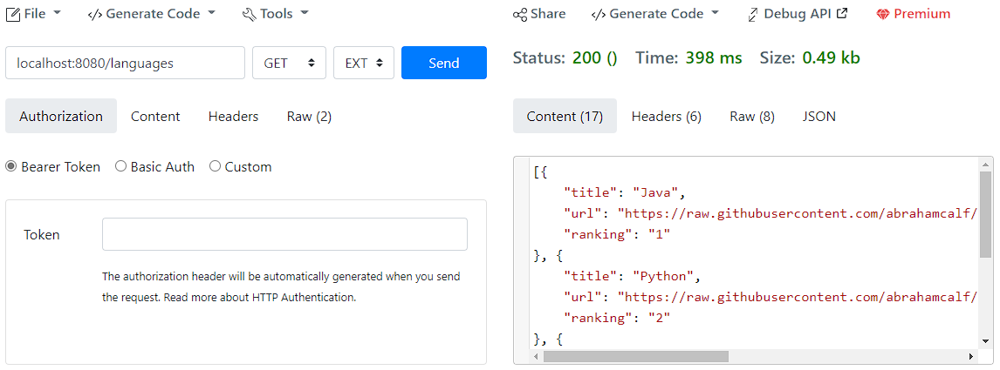
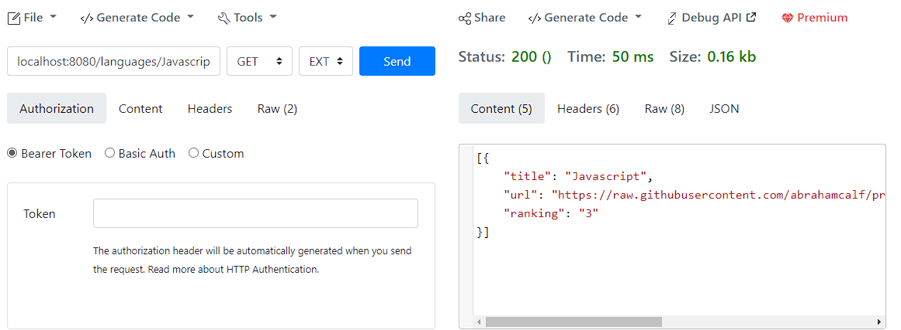
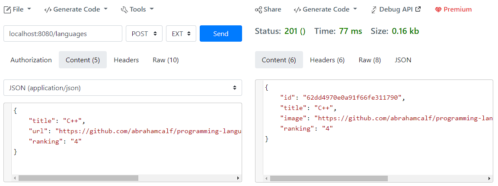
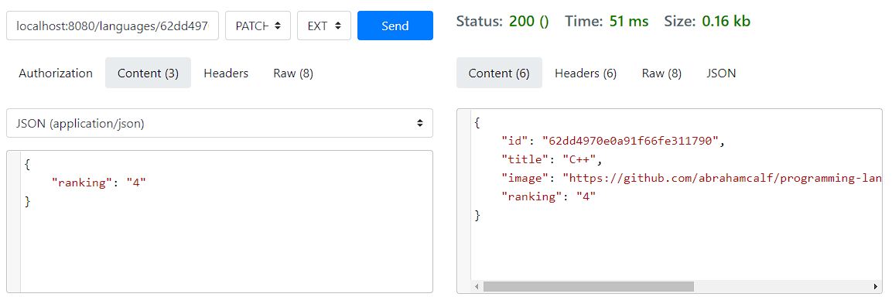
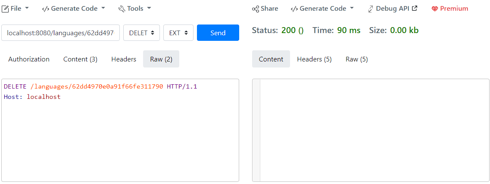

# Linguagens Ranking 

Esse projeto é um desafio realizado durante a imersão java_ da Alura, onde foi implementada uma aplicação java com o framework Springboot.
Testes do CRUD foram realizados com [Reqbin](https://reqbin.com/)

Link de acesso: https://languages-prog.herokuapp.com/languages

## Tecnologia utilizada
1. **Java 17**
2. **Spring Boot 3.0.0(M4) com as denpedências: Spring Web, Spring Data MongoDB e Lombok** 
3. **Mongo DB Atlas**
4. **Heroku**

## Deafios a serem desenvolvidos

- [x] Finalizar o CRUD (Create, Read, Update e Delete) para que se possa atualizar e excluir uma linguagem cadastrada;
- [x] Devolver a listagem ordenada pelo ranking;
- [x] Criar na sua API um modelo de entidade com nomes diferentes de title e image e criar seu próprio extrator de informações personalizado OU, manter com o nome title e image e traduzir para que seja retornado como título e imagem através do uso de DTO (Data Transfer Object);
- [x] Retornar o status 201 quando um recurso (linguagem, no nosso caso) for cadastrado através do POST;
- [x] Desafio supremo: Aplicar modificações parciais no recurso através do método PATCH, por exemplo, modificando o número de votos ou de pessoas que utilizam cada linguagem de programação.

## Testes
- Método GET

- Método GET por Nome

- Método POST

- Método PATCH

- Método DELETE
